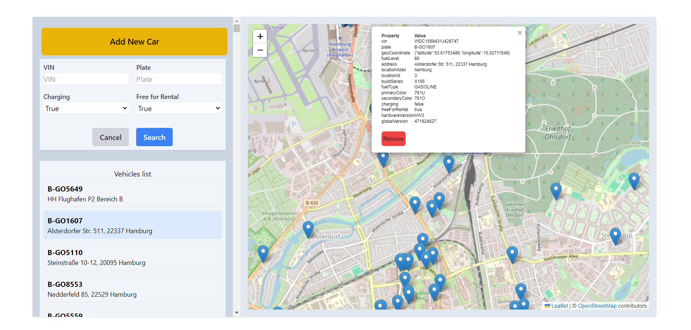

# Vehicle Management Application

Vehicle Management Application is a web application built with **React**, **TypeScript**, **Vite**, and **Leaflet** to manage and display vehicle data on a map. The app is fully responsive and provides a modern, fast, and user-friendly interface for interacting with vehicle information.



## Features

1. **Interactive Map View**

   - Using Leaflet to display vehicle locations on a responsive map.
   - Displays vehicles as markers on a map
   - Clicking a marker shows a popup with detailed vehicle information

2. **Vehicle Management**

   - Add new vehicles by clicking on the map or using an "Add" button
   - Remove existing vehicles by clicking on their markers

3. **Filtering Capabilities**

   - Filter vehicles by:
     - VIN
     - Plate number
     - Charging status
     - Availability for rental

4. **Performance Optimizations**

   - Implements lazy loading for efficient data fetching
   - Utilizes `useMemo`, `useEffect` and `callBack`for optimized rendering of components
   -

5. **State Management**

   - Uses Redux Toolkit for centralized state management

6. **Responsive Design**
   - Fully optimized for various screen sizes and devices.

## Performance Considerations

- The application uses lazy loading to efficiently fetch and display large sets of vehicle data.
- React's `useMemo` hook is employed to optimize rendering performance, particularly for the vehicle list and map components.
- Redux Toolkit is used for efficient state management, helping to maintain a clear and performant data flow throughout the application.

## Testing

The application includes unit tests for critical functionality, including:

- Adding new vehicles
- Redux state management
- Utility functions

To run the tests, use the command `npm test`.

## Technologies

- **React**: A JavaScript library for building user interfaces.
- **TypeScript**: A superset of JavaScript that adds static types.
- **Vite**: A fast build tool that leverages ES modules for faster development.
- **Redux Toolkit**: For efficient state management.
- **Leaflet**: A lightweight JavaScript library for interactive maps.
- **Tailwind CSS**: For utility-first styling.

## Installation

To get started with the project:

1. Clone the repository:
   ```bash
   git clone https://github.com/mkalantari96/VehiclesMapApp.git
   cd VehiclesMapApp
   ```
2. Install dependencies:
   ```bash
   npm install
   ```
3. Start the development server:
   ```bash
   npm run dev
   ```

## Folder Structure

```bash
src/
│
├── api/                # API logic for vehicle data
├── components/         # Reusable components (VehicleForm, VehicleList, Map, ...)
└── store/              # Redux store and slices (vehicleSlice)
```
